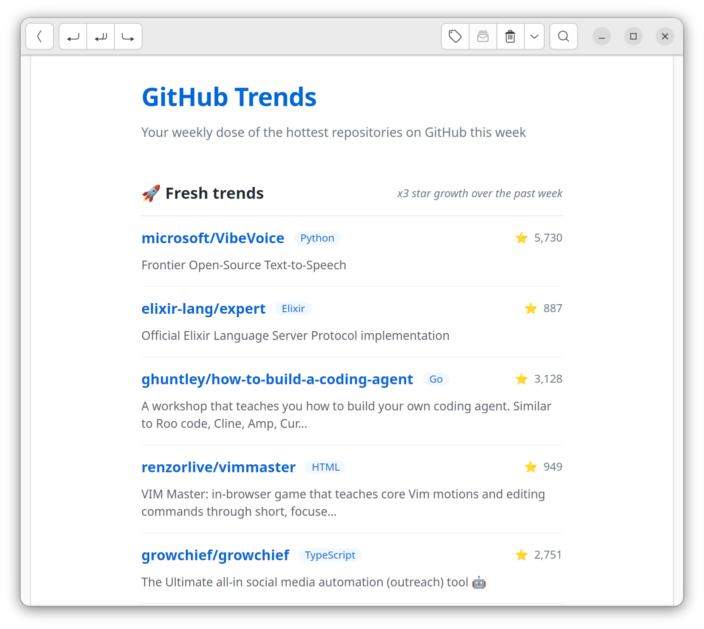
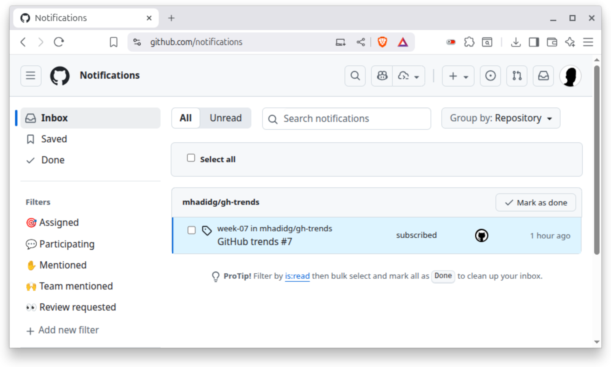

<div align="center">

# Github trends

[](https://github.com/mhadidg/gh-trends/actions)
[](https://opensource.org/licenses/MIT)
[](https://nodejs.org/)

Weekly newsletter featuring *fresh* trending Github projects. The top 20 picks *every week*.

✉️ Email newsletter | 🔔 GitHub inbox notifications | 📶 RSS feed

</div>



I wrote about my motive in a [blog post](https://hadid.dev/posts/github-trends/). If you're curious
about the technical details, the post covers that too.

## How to subscribe

You can subscribe via one of the these channels:

- Github notifications (via releases)
- Email newsletter
- RSS feed (individual repo feeds)

### Github notifications 

*Cadence*: weekly (every Monday)

The recommend channel is *Github release*:

- Click **Watch** 👀
- Select **Custom**
- Check **Releases**

That's it. You will get notified of new releases. Here's an example.



### Email newsletter

*Cadence*: weekly (every Monday)

Subscribe [here](https://forms.gle/dbPQMaD1jamqfMg29).

> [!NOTE]
> I'm using *Google Forms* for now. That's a bit amateur-ish and not super encouraging, I know. A fancy
> subscription page is on my TODO list.

### RSS feed

*Cadence*: twice daily (roughly at 00:00 and 12:00)

```
https://raw.githubusercontent.com/mhadidg/gh-trends/refs/heads/main/feed/rss.xml
```

## Quick setup

Everything is running on Github Actions; serverless, zero operational cost (except for the email bit), and fully
automated.

```bash
# Install deps
npm install

# Copy default config
cp .env.example .env

# Preview locally
npm run preview:live

# Show me more please
RELEASE_TOP_N=40 npm run preview:live

```

### Sending email

The project supports sending via either *Resend* or *Buttondown* (you can do both, but I wouldn't recommend). Both have
free tier more than enough for personal or team-wide use.

You will need to setup tokens (with few more vars for *Resend*) to send an email. Those should be configured as
*Secrets* under the forked repo:

- Settings
- Secrets and variables
- Actions
